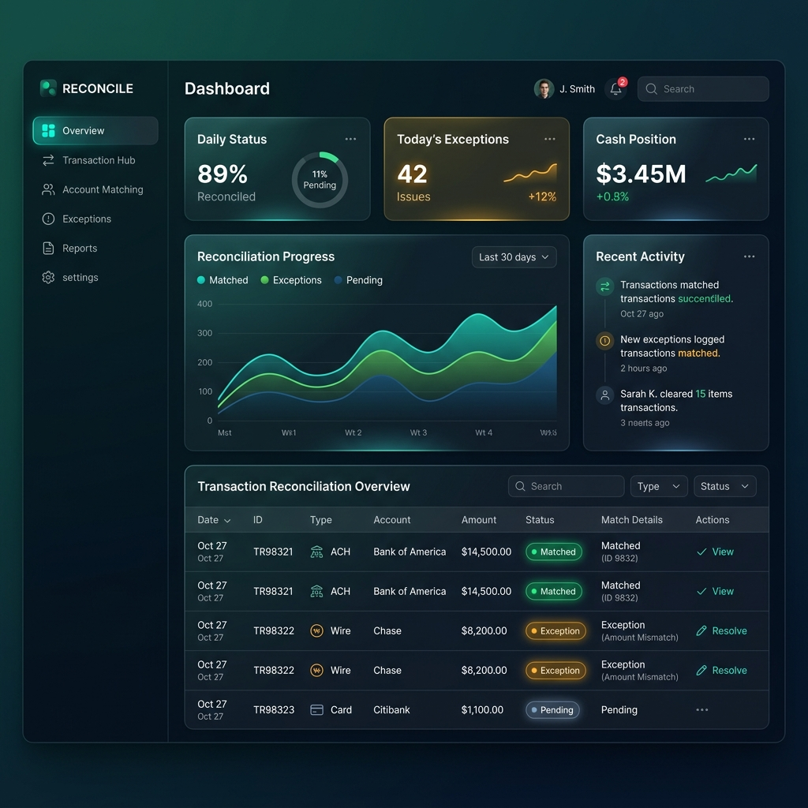

# Plano de Implementação — Refatoração de Design Premium (Fase UAT)

Este plano descreve o redesenho visual completo da ferramenta de conciliação contábil para torná-la moderna, premium e altamente utilizável em testes de aceitação (UAT).

## Imagem do Mockup Proposto
Abaixo está o conceito visual gerado para o dashboard em Dark Mode com a paleta Azul Esmeralda Escuro:



---

## Decisões de Design Alinhadas

* **Tema e Cores:** Paleta "Azul Esmeralda Escuro" (combinação de verde-esmeralda sofisticado e tons profundos de azul/teal). No Dark Mode, usaremos o fundo neutro Slate Escuro (`slate-950`) para maximizar contraste e foco nos dados.
* **Dark Mode:** Implementação nativa via classe Tailwind, orquestrada pelo pacote `next-themes` para evitar cintilação (*flickering*) em SSR.
* **Tipografia:** Uso das fontes Google Fonts: **Outfit** para cabeçalhos (trazendo ar moderno e arrojado) e **Inter** para textos gerais e tabelas (garantindo excelente legibilidade de dados numéricos).
* **Navegação:** Substituição do menu superior por um menu lateral (**Sidebar**) colapsável e interativo, contendo o logotipo, links de navegação com ícones modernos, botão de alternância de tema (Claro/Escuro) e dados do usuário/logout no rodapé.
* **Tabelas e Grids:** Redesenho para o modelo de **Grid Interativo Denso** — com linhas mais compactas, realce por hover brilhante, e detalhes expansíveis diretamente na tabela.

---

## Proposta de Mudanças por Componente

### 1. Infraestrutura e Estilo Global

#### [MODIFY] [package.json](file:///c:/Users/Joao/Documents/Projeto%20conciliador/package.json)
* Adição das dependências:
  * `next-themes` (gerenciador de tema SSR)
  * `lucide-react` (biblioteca de ícones premium leves e modernos)

#### [MODIFY] [tailwind.config.ts](file:///c:/Users/Joao/Documents/Projeto%20conciliador/tailwind.config.ts)
* Ativação de `darkMode: 'class'`.
* Extensão de temas no Tailwind:
  * Cores personalizadas para a marca (`brand` baseada em tons esmeralda-azulados `#0284c7`, `#0d9488` e escuros `#042f2e`).
  * Configuração das famílias de fonte `font-sans` (Inter) e `font-display` (Outfit).

#### [MODIFY] [globals.css](file:///c:/Users/Joao/Documents/Projeto%20conciliador/src/app/globals.css)
* Customização de estilos de scrollbar modernos.
* Criação de classes auxiliares para efeitos de vidro (*glassmorphism*), gradientes suaves e micro-interações.

#### [NEW] [Providers.tsx](file:///c:/Users/Joao/Documents/Projeto%20conciliador/src/components/Providers.tsx)
* Provedor React para encapsular o `ThemeProvider` do `next-themes`.

#### [MODIFY] [layout.tsx](file:///c:/Users/Joao/Documents/Projeto%20conciliador/src/app/layout.tsx)
* Importação e configuração do carregamento das fontes `Outfit` e `Inter` do `next/font/google`.
* Encapsulamento de toda a aplicação no componente `Providers`.

---

### 2. Layout da Aplicação e Navegação (Sidebar)

#### [MODIFY] [layout.tsx](file:///c:/Users/Joao/Documents/Projeto%20conciliador/src/app/(app)/layout.tsx)
* Criação da estrutura de grid de duas colunas:
  * **Coluna 1 (Sidebar):** Menu colapsável com ícones de navegação dinâmicos (`lucide-react`), botão de alternância de tema (*ThemeToggle*) e rodapé com perfil do usuário logado.
  * **Coluna 2 (Main Content):** Área de conteúdo rolável com espaçamento refinado e transição suave.
* Suporte responsivo a dispositivos móveis (Sidebar vira gaveta / *mobile drawer*).

#### [NEW] [Sidebar.tsx](file:///c:/Users/Joao/Documents/Projeto%20conciliador/src/components/layout/Sidebar.tsx)
* Componente cliente que controla o estado de colapso, links ativos e renderização.

#### [NEW] [ThemeToggle.tsx](file:///c:/Users/Joao/Documents/Projeto%20conciliador/src/components/layout/ThemeToggle.tsx)
* Botão elegante para alternar entre os temas Claro, Escuro e Sistema.

---

### 3. Redesenho das Telas e Componentes de Negócio

#### [MODIFY] [UploadRazao.tsx](file:///c:/Users/Joao/Documents/Projeto%20conciliador/src/components/upload/UploadRazao.tsx)
* Transformação da área de upload em uma zona de *drag-and-drop* moderna.
* Substituição de alertas estáticos por cards com gradientes e micro-animações no progresso.

#### [MODIFY] [page.tsx](file:///c:/Users/Joao/Documents/Projeto%20conciliador/src/app/(app)/lancamentos/page.tsx) e [FiltrosLancamentos.tsx](file:///c:/Users/Joao/Documents/Projeto%20conciliador/src/components/lancamentos/FiltrosLancamentos.tsx)
* Otimização dos campos de filtros (mais compactos e alinhados).
* Redesenho da tabela de lançamentos para estilo de planilha executiva densa.
* Destaque com efeito de brilho e badges coloridos com alto contraste de legibilidade nos status (Conciliado, Pendente, Divergência).

#### [MODIFY] [page.tsx](file:///c:/Users/Joao/Documents/Projeto%20conciliador/src/app/(app)/conciliacao/page.tsx)
* Reformulação da tabela de sessões para um layout limpo com barras de progresso visual de matching (ex: porcentagem de linhas conciliadas).

#### [MODIFY] [page.tsx](file:///c:/Users/Joao/Documents/Projeto%20conciliador/src/app/(app)/conciliacao/[id]/page.tsx)
* Workspace de conciliação com design de cartões de KPI interativos em grade.
* Exibição das tabelas de pares conciliados e pendências de forma mais intuitiva, usando bordas esmeralda sutis para pares aprovados e realces coloridos nos botões de ação rápida.

#### [MODIFY] [WorkspaceComparacao.tsx](file:///c:/Users/Joao/Documents/Projeto%20conciliador/src/components/comparacao/WorkspaceComparacao.tsx)
* Redesenho das abas e melhor contraste nos lançamentos sem contrapartida.
* Alinhamento visual da tabela de pares com detalhes adicionais mais limpos.

#### [MODIFY] [page.tsx](file:///c:/Users/Joao/Documents/Projeto%20conciliador/src/app/(app)/relatorios/page.tsx)
* KPI Cards premium com pequenas linhas de tendência ou ícones informativos.
* Barra de progresso de Aging refinada com cores que degradam de esmeralda a vermelho conforme o atraso aumenta.

---

## Plano de Verificação

### Testes Automatizados
* Garantir que todas as verificações de tipos continuam passando:
  ```bash
  npm run typecheck
  ```
* Rodar a suíte de testes existente do parser e da engine para garantir que nenhuma alteração visual quebrou a lógica:
  ```bash
  npm run test
  ```

### Verificação Manual
1. Iniciar o servidor local:
   ```bash
   npm run dev
   ```
2. Realizar testes em tela:
   * Testar a responsividade da Sidebar em tamanhos Mobile, Tablet e Desktop.
   * Alternar os temas (Claro/Escuro) em cada uma das páginas (`/importacao`, `/lancamentos`, `/conciliacao`, `/comparacao`, `/book` e `/relatorios`).
   * Verificar se não há flashes de tela branca ao recarregar a página com o tema escuro ativo.
   * Testar a expansibilidade dos painéis interativos de pares e detalhes na tabela de lançamentos.
